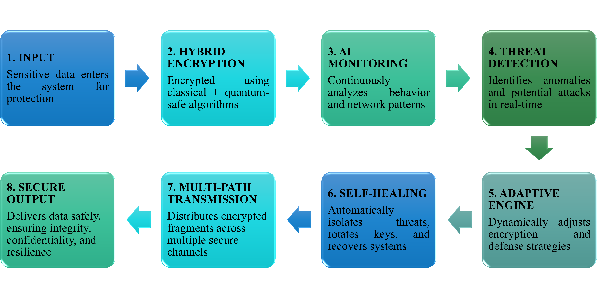

# CIPHERZENITH — Peak Security for a Quantum Future

> **AI-Powered Post-Quantum Secure Transaction System**

CipherZenith is a security framework designed to strengthen digital transactions against **evolving cyber threats and future quantum-computing risks**. It combines **post-quantum cryptography, AI-based anomaly detection, adaptive security, and automated threat response** into a unified transaction-security pipeline.

## Key Capabilities

* **Post-Quantum Cryptography**

  * AES-256-GCM for data encryption
  * ML-KEM (Kyber512 / Kyber1024) for key exchange
  * ML-DSA (Dilithium) for digital signatures

* **AI-Driven Threat Detection**

  * Transaction anomaly detection
  * Velocity and freshness checks
  * Isolation Forest–based analysis

* **Adaptive Security**

  * Dynamic cryptographic-strength escalation
  * Kyber512 → Kyber1024 switching for higher-risk conditions
  * Automated key rotation

* **Self-Healing Security**

  * Threat isolation
  * Security-state updates
  * Automated response mechanisms

* **Multi-Platform Interface**

  * FastAPI security backend
  * React-based security dashboard
  * Flutter-based CipherPay application

---

## Security Pipeline

## 8-Stage Security Architecture

CipherZenith follows an eight-stage layered security architecture, combining
cryptographic protection, AI-based monitoring, threat detection, adaptive
security, self-healing mechanisms, secure transmission, and protected output.

  

### Pipeline Overview

| Stage | Security Function |
|---|---|
| **01 — Input** | Sensitive data enters the system for protection |
| **02 — Hybrid Encryption** | Classical + quantum-safe encryption |
| **03 — AI Monitoring** | Continuous behavioural and network analysis |
| **04 — Threat Detection** | Real-time anomaly and attack identification |
| **05 — Adaptive Engine** | Dynamically adjusts security strategies |
| **06 — Self-Healing** | Threat isolation and cryptographic key rotation |
| **07 — Multi-Path Transmission** | Secure distribution of encrypted fragments |
| **08 — Secure Output** | Protected delivery with integrity and confidentiality |

---

## Technology Stack

| Component               | Technology                          |
| ----------------------- | ----------------------------------- |
| Backend                 | Python, FastAPI, Uvicorn            |
| AI / ML                 | Isolation Forest, anomaly detection |
| Symmetric Encryption    | AES-256-GCM                         |
| PQC Key Exchange        | ML-KEM / Kyber512 / Kyber1024       |
| PQC Signatures          | ML-DSA-44 / ML-DSA-65               |
| Real-Time Communication | WebSockets                          |
| Web Dashboard           | React, Tailwind CSS                 |
| Mobile Application      | Flutter, Dart                       |
| Authentication          | Biometric Authentication, UPI PIN   |
| Version Control         | Git, GitHub                         |

## Validation & Results

* **97/97 cryptography unit tests passed**
* **38/38 AES tests passed**
* **59/59 hybrid cryptography tests passed**
* Verified integration of **AES-256-GCM, Kyber512, Kyber1024 and ML-DSA**
* Demonstrated **dynamic algorithm switching and key rotation**
* Validated end-to-end communication between the **backend, security dashboard and CipherPay application**

## System Components

### Backend

Responsible for transaction processing, cryptographic operations, threat analysis, security decisions and real-time communication.

### AI Security Engine

Analyses transaction behaviour and identifies potentially anomalous activity using rule-based checks and machine-learning techniques.

### Security Dashboard

Provides security operators with visibility into transaction activity, risk indicators, cryptographic state and detected threats.

### CipherPay

A Flutter-based transaction interface providing secure user authentication and payment interaction.

---

## Security Design Principles

**CONFIDENTIALITY** - 
Protect sensitive transaction data using authenticated encryption.

**AUTHENTICITY** - 
Verify transaction integrity and identity using post-quantum signatures.

**ADAPTABILITY** - 
Adjust security mechanisms according to detected transaction risk.

**RESILIENCE** - 
Support automated key rotation and threat-response mechanisms.

**QUANTUM READINESS** - 
Integrate post-quantum cryptographic primitives into the transaction workflow.

---

## Impact

CipherZenith demonstrates how **post-quantum cryptography and intelligent security monitoring can work together** to create a more resilient digital-transaction architecture.

The modular design provides a foundation that can be extended beyond payments to other applications requiring **secure, authenticated and continuously monitored transactions**.

**Aligned with UN SDG 9 — Industry, Innovation and Infrastructure.**

---

## Team — ByteStorm Crew

| Member                   | Role                           |
| ------------------------ | ------------------------------ |
| **Tamilvel Mugunthan S** | Cryptography Engineer          |
| **Jenifer Vincy A**      | Backend & AI Engineer          |
| **Mohamed Idrees A S**   | Frontend & Security Engineer   |
| **Trishna B**            | DevOps & Flutter App Developer |

**Mentor:** Dr. R. Lal Raja Singh
**HOD, EEE — KIT – Kalaignarkarunanidhi Institute of Technology**

**Team ID:** `IG26P03591`
**Track:** `IEngage`

---

## Future Scope

* Extended behavioural-threat modelling
* Enhanced transport integrity and tamper detection
* Production-scale post-quantum deployment
* Broader adoption across secure digital-transaction platforms

---

### **CIPHERZENITH**

**Secure Today. Quantum Ready Tomorrow.**

